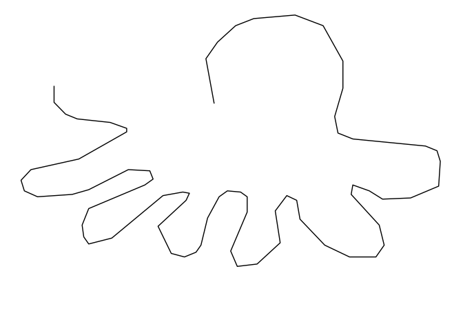

<!-- README.md is generated from README.Rmd. Please edit that file -->

# quickdraw

<!-- badges: start -->

<!-- badges: end -->

The `quickdraw` package allows you to download and retrieve the dataset
categories from the quickdraw dataset:

## Installation

You can install the released version of quickdraw from
[CRAN](https://CRAN.R-project.org) with:

``` r
install.packages("quickdraw")
```

And the development version from [GitHub](https://github.com/) with:

``` r
# install.packages("devtools")
devtools::install_github("huizezhang-sherry/quickdraw")
```

## Data Retrieval

Data files are cached and retrieved using the `qd_read` function:

``` r
library(quickdraw)

octopus <- qd_read("octopus")
#> QuickDraw file: octopus.ndjson has been downloaded already!
octopus
#> # A tibble: 150,152 x 6
#>    word    countrycode timestamp           recognized key_id      drawing  
#>    <chr>   <chr>       <chr>               <lgl>      <chr>       <list>   
#>  1 octopus CZ          2017-03-05 10:52:2… TRUE       4599994839… <list [1…
#>  2 octopus CH          2017-01-23 21:23:0… TRUE       6746256573… <list [1…
#>  3 octopus DE          2017-03-20 10:26:0… TRUE       5419213730… <list [9…
#>  4 octopus SK          2017-03-03 21:40:1… TRUE       5953290716… <list [1…
#>  5 octopus DE          2017-01-27 20:01:5… TRUE       5005193466… <list [2…
#>  6 octopus DE          2017-03-02 10:24:1… TRUE       6724261806… <list [7…
#>  7 octopus BR          2017-01-26 17:49:0… TRUE       5064235442… <list [1…
#>  8 octopus RU          2017-03-23 11:21:5… TRUE       4876295202… <list [1…
#>  9 octopus US          2017-03-03 16:00:5… TRUE       6670279134… <list [1…
#> 10 octopus DE          2017-01-27 20:54:1… TRUE       6018386049… <list [1…
#> # … with 150,142 more rows
```

The last column is a nested list which is a drawing made, it consists of
the x,y coordinates for each stroke:

*You will have to properly install the R package `cloudml` and a command line tool, gsutil, for `qd_read()` to read data properly from Google Cloud Storage. To install gsutil, type `cloudml::gcloud_install()` in the console and follow the instructions.*

You can draw a pic with `qd_tidy` and `qd_draw`

``` r
octopus %>% 
  qd_tidy(10) %>% 
  qd_draw()
```



You could also animate multiple drawings with `qd_draw`

``` r
octopus %>% 
  qd_tidy(sample.int(nrow(octopus), 6)) %>% 
  qd_draw(animate = TRUE)
```


